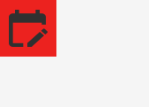

<a id="top"></a>
<div align="center">
  
  <h1>🚀 NexusTech 2026</h1>
  <h3>Global Tech & Developer Summit — Premier Event Landing Page</h3>
  <p>A modern, high-converting, and feature-rich web application built from scratch using pure HTML5, CSS3, and Vanilla JavaScript (ES6+).</p>
  <!-- Primary Action Badges -->
  <a href="https://rahulxdev1201.github.io/event-landing-page/" target="_blank" rel="noopener noreferrer">
    
  </a>
<!-- GitHub Repository Badge -->
<a href="https://github.com/RaHuLxDeV1201/event-landing-page" target="_blank" rel="noopener noreferrer">
  
</a>
  <a href="https://rahulxdev1201.github.io/event-landing-page/" target="_blank" rel="noopener noreferrer">
    
  </a>
  <br /><br />
  <!-- Technology Badges -->
  
  
  
  
  
</div>

---
## 📌 Table of Contents

- [Overview](#-overview)
- [Key Features & Capabilities](#-key-features--capabilities)
- [Lighthouse Audit Metrics](#-lighthouse-audit-metrics)
- [Interactive Component Highlights](#-interactive-component-highlights)
- [Project Architecture](#-project-architecture)
- [Local Setup & Quick Start](#-local-setup--quick-start)
- [Third-Party Credits](#-third-party-credits)
- [License](#-license)

---

## 📖 Overview

**NexusTech 2026** is a state-of-the-art event landing page designed to maximize conversions for tech summits, global developer conferences, and hackathons. Engineered with zero framework overhead, the application delivers fluid glassmorphism visual aesthetics, dynamic itemized pricing calculations, 1-click Google Calendar integration, and multi-tier schedule filtering.

🌐 **Production Website:** [https://rahulxdev1201.github.io/event-landing-page/](https://rahulxdev1201.github.io/event-landing-page/)

---

## ✨ Key Features & Capabilities

| Feature Component | Capability & Technical Overview |
| :--- | :--- |
| 🌙 **Theme Engine** | Dark & Light mode toggle with state persistence in `localStorage` |
| 🎟️ **Pass Calculator** | Dynamic pass quantity engine + live promo code discount (**`NEXUS50`**) |
| 🎉 **Confetti Cannon** | Physics-based canvas particle explosion upon registration |
| 📅 **Calendar Generator** | 1-click custom Google Calendar link builder for summit sessions |
| 👥 **Speaker Modals** | Interactive bio popovers with detailed keynote speaker metadata |
| 📅 **3-Day Summit Agenda** | Tabbed schedule navigation (AI & ML, Web3 & Cloud, Hackathon) |
| 🔍 **Live Search Engine** | Real-time category and keyword filter with dynamic badge counters |
| 🏆 **$50,000 Hackathon** | Interactive prize breakdowns + live team registration progress tracker |
| ♾️ **Marquee Ticker** | Smooth CSS infinite logo carousel showcasing partner sponsors |
| ❓ **FAQ Accordion** | Accessible smooth expanding questions and answers |
| 📝 **Form Validation** | Regex validation for name, email, and phone with toast popups |

---

## 📊 Lighthouse Audit Metrics

Audited using **Google Lighthouse** to ensure maximum performance, accessibility, and SEO:

| Audit Category | Score | Metric Status | Engineering Focus |
| :--- | :---: | :---: | :--- |
| ⚡ **Performance** | **97 / 100** | 🟢 Passed | Deferred script loads, zero heavy JS bundles, low FCP |
| ♿ **Accessibility** | **93 / 100** | 🟢 Passed | High-contrast glass colors, ARIA attributes, keyboard nav |
| ✅ **Best Practices** | **100 / 100** | 🟢 Passed | Semantic HTML5 tags, zero console warnings, valid markup |
| 🔍 **SEO** | **100 / 100** | 🟢 Passed | Structured OpenGraph metadata, crawlable heading hierarchy |

<div align="left">
  
  
  
  
</div>
---

## 🛠️ Interactive Component Highlights

### 🎟️ Promo Code Engine
Enter promo code `NEXUS50` in the Pass Registration modal to apply an instant 50% discount:
```javascript
// Promo code calculation engine snippet
if (promoCode.trim().toUpperCase() === "NEXUS50") {
    discountRate = 0.5; // 50% discount
    showToast("Promo Code NEXUS50 Applied! (50% Off)", "success");
}
```

---

## 📁 Project Architecture

```text
event-landing-page/
├── assets/
│   ├── logo.svg           # Primary brand vector mark (Red & Dark Slate)
│   └── favicon.ico        # Browser tab favicon
├── index.html             # Semantic HTML5 layout structure
├── style.css              # Custom CSS design system & glassmorphic utilities
├── script.js              # Vanilla JS ES6+ interactive application engine
├── README.md              # Technical documentation & project guide
└── LICENSE                # Open-source MIT License
```

---

## 🚀 Local Setup & Quick Start

1. **Clone the Repository:**
   ```bash
   git clone https://github.com/RaHuLxDeV1201/event-landing-page.git
   ```

2. **Navigate to the Project Folder:**
   ```bash
   cd event-landing-page
   ```

3. **Run the Application:**
   * Double-click `index.html` to open directly in any modern browser.
   * Or serve with VS Code **Live Server** extension.

---

## 🎨 Third-Party Credits

* **Typography:** [Google Fonts](https://fonts.google.com/) (`Outfit` & `Plus Jakarta Sans`)
* **Vector Icons:** [FontAwesome 6.4 CDN](https://cdnjs.cloudflare.com)
* **Stock Photography:** High-resolution developer imagery provided by [Unsplash](https://unsplash.com)

---

## 📄 License

Distributed under the **MIT License**. See `LICENSE` for full details.

<p align="center">
  <a href="#top"><strong>⬆ Back to Top</strong></a>
</p>

<p align="center">
  Engineered by <a href="https://github.com/RaHuLxDeV1201"><strong>RaHuLxDeV</strong></a>
</p>
